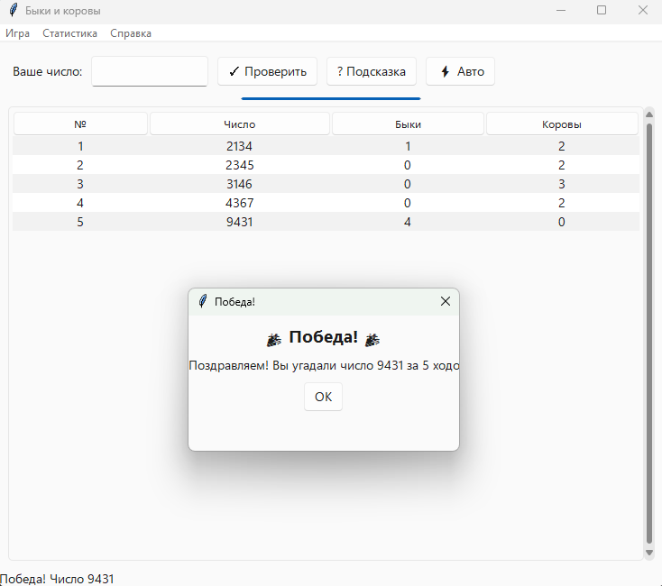

### README.en.md

# Bulls and Cows Game

[Русская версия](README.md)

A classic logic game "Bulls and Cows" (a variation of Mastermind) with a graphical interface built with Python and Tkinter.  
The goal is to guess a number generated by the computer in as few moves as possible.



## Features

- Choose the length of the secret number (from 3 to 6 digits)
- Option to allow or forbid repeated digits
- Modern interface with light and dark themes (using `sv-ttk` library)
- Move history table with alternating row colors
- Progress bar showing current guessing progress
- Hints (reveal one random position)
- Auto-solve (computer shows the secret number)
- Game statistics (games played, wins, average moves, best score, hints used, auto-solves)
- Settings and statistics saved between runs (JSON files)
- Two languages supported: Russian and English (switch in settings)

## Technologies

- Python 3.14 (or 3.10+)
- Tkinter (included in standard Python distribution)
- `sv-ttk` — modern ttk theme
- PyInstaller (for building .exe)

## Installation and Running

### 1. Clone the repository

```bash
git clone https://github.com/tnixxx/bullsncows.git
cd bullsncows

### 2. Install dependencies

Make sure you have Python installed (version 3.10 or higher). Then install the `sv-ttk` library:

```bash
pip install sv-ttk
```

To build an executable file, you will also need PyInstaller:

```bash
pip install pyinstaller
```

### 3. Run the game

```bash
python main.py
```

### 4. Build .exe (for Windows)

```bash
pyinstaller --onefile --windowed --name "BullsAndCows" main.py
```

The resulting `BullsAndCows.exe` will be in the `dist` folder.

## How to Play

1. A new number is generated at startup.
2. Enter your guess in the input field and click "Check" or press Enter.
3. The table will show the number of "bulls" (digits in the correct position) and "cows" (digits present but in the wrong position).
4. Continue until you guess all digits.
5. Upon victory, a congratulation message appears and statistics are updated.

## Settings

In the "Game" → "Settings" menu you can change:
- Number length (3–6)
- Allow/disallow repeated digits
- Interface theme (light / dark)
- Language (Russian / English)

## Project Structure

- `main.py` — entry point
- `gui.py` — graphical interface (main window, settings dialog)
- `game_logic.py` — game logic (number generation, guess checking, hints)
- `settings.py` — settings management (save/load)
- `stats.py` — statistics management
- `i18n.py` — localization module (Russian and English support)
- `settings.json` — settings file (created automatically)
- `stats.json` — statistics file (created automatically)

## Author

Gleb Vasilyev, student of group ISPt-22-(9)-2  
Project completed as part of the final qualification work.
